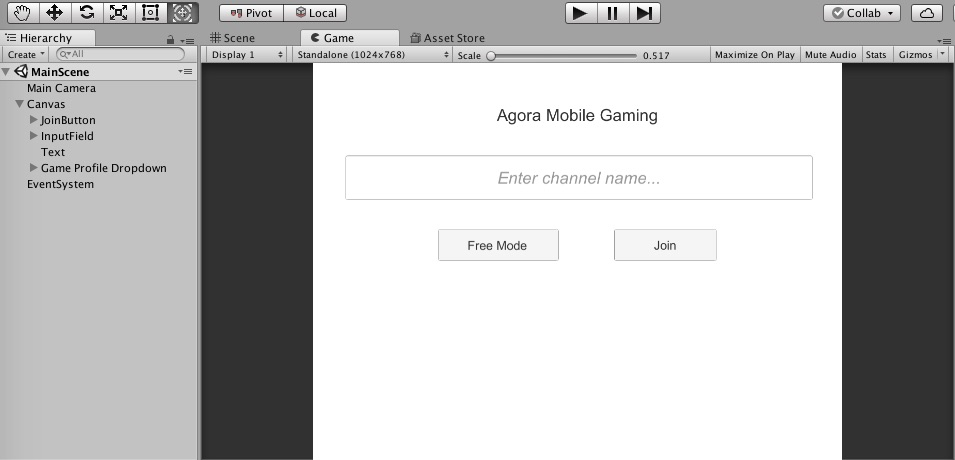
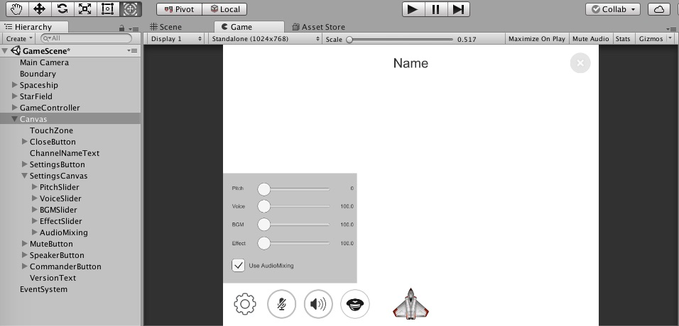

# Spacewar with AMG Voice SDK for Unity

*Read this in other languages: [中文](README.zh.md)*

This tutorial enables you to quickly get started with using a sample app to integrate voice chat into your [Unity 3D](https://unity3d.com) game application using the Agora Gaming SDK.

With this sample app, you can:

- [Join / leave a channel](#add-join-leave-channel-methods)
- [Select voice modes](#add-agora-engine-methods)
- [Mute / unmute audio](#add-button-and-slider-methods)
- [Mix music / play audio effects](#add-background-music-methods)
- [Morphe voice audio](#add-button-and-slider-methods)
- [Set voice and audio effect positions](#add-button-and-slider-methods)
- [Set voice and audio effect volumes](#add-button-and-slider-methods)

## Prerequisites
- Agora.io Developer Account
- Unity 3D 5.5+

## Quick Start
This section shows you how to prepare and build the Agora React Native wrapper for the sample app.

### Create an Account and Obtain an App ID
To build and run the sample application you must obtain an App ID:

1. Create a developer account at [agora.io](https://dashboard.agora.io/signin/). Once you finish the signup process, you will be redirected to the Dashboard.
2. Navigate in the Dashboard tree on the left to **Projects** > **Project List**.
3. Copy the App ID that you obtained from the Dashboard into a text file. You will use this when you launch the app.

### Update and Run the Sample Application

1. Edit the [`ApplicationModel.cs`](Assets/MainScene/Scripts/HelloUnityVideo.cs) file. In the `ApplicationModel` class declaration, update `Your App Id` with your App ID.

	`static public string AppId = "Your App Id";`

2. Download the [Agora Gaming SDK](https://www.agora.io/en/download/) for Unity 3D.

	

3. Unzip the downloaded SDK package and copy the files from the following SDK folders into the associated sample application folders.

SDK Folder|Application Folder
---|---
`libs/Android/`|`Assets/Plugins/Android/`
`libs/iOS/`|`Assets/Plugins/iOS/`
`libs/Scripts/AgoraGamingSDK/`|`Assets/Scripts/AgoraGamingSDK/`

4. Open the project in Unity and run the sample application.

## Steps to Create the Sample

The sample application is comprised of two main classes, `MainScene` and `GameScene`.

- [Create the Scenes](#create-the-scenes)
- [Create the MainScene Classes](#create-the-mainscene-classes)
- [Create the GameScene Classes](#create-the-gamescene-classes)

### Create the Scenes

The sample application consists of two main Unity scenes.

#### Create MainScene

When you load `MainScene` in Unity, you'll see that the stage contains the following:

UI Element|Description
---|---
Text element|Title for the application.
Text input box|Text box to enter the channel name.
Game profile dropdown menu|Dropdown menu to choose the join mode. Available modes are: **Free Mode**, **Commander Mode**, and **Audience Mode**.
**Join** button|Button to join the channel.



#### Create GameScene

When you load `GameScene` in Unity, you will see the stage contains the following key elements:

UI Element|Description
---|---
**Name** Text element|Text for the channel name.
**X** button|Close button to exit the channel.
**Pitch** slider|Slider to control the audio pitch.
**Voice** slider|Slider to control the voice volume.
**BGM** slider|Slider to control the background music.
**Effect** slider|Slider to control the audio effect.
**Use AudioMixing** checkbox|Checkbox to turn on/off audio mixing.
Button with a picture of a cog|Button to manage application settings.
Button with a picture of a microphone|Button to mute/unmute audio.
Button with a picture of a speaker|Button to turn on/off the speakerphone.
Button with a picture of a hat|Button to change the commander.
Spaceship sprite|Object that controls the game shooting.



### Create the MainScene Classes

`MainScene` uses 4 classes to manage the key UI elements and information for the layout: `ApplicationModal`, `ChannelNameInputField`, `GameProfileDropdown`, and `JoinButton`.

- [Create the ApplicationModal Class](#create-the-applicationmodal-class)
- [Create the ChannelNameInputField Class](#create-the-channelnameinputfield-class)
- [Create the GameProfileDropdown Class](#create-the-gameprofiledropdown-class)
- [Create the JoinButton Class](#create-the-joinbutton-class)


#### Create the ApplicationModal Class

The `ApplicationModal` class initializes 3 variables that act as basic app settings:

Variable|Description
---|---
`AppId`|Agora App ID.
`ChannelName`|Name for the channel.
`AudioGameProfile`|Audio game profile setting for the app.

```csharp
using System.Collections;
using System.Collections.Generic;
using UnityEngine;

public class ApplicationModal {
	static public string AppId = //"Your App Id";
	static public string ChannelName = "";

	//0: Game_Free; 1: Game_Command + Broadcaster; 2: Game_Command + Audience
	static public int AudioGameProfile = 0;
}
```

#### Create the ChannelNameInputField Class

The `ChannelNameInputField` class manages the channel name text input box, defined in the layout.

When the application starts, initialize the text for `inputField` to the default `ChannelName` defined in `ApplicationModal`.

```csharp
using System.Collections;
using System.Collections.Generic;
using UnityEngine;
using UnityEngine.UI;

public class ChannelNameInputField : MonoBehaviour {

	public InputField inputField;

	void Start () {
		inputField.text = ApplicationModal.ChannelName;
	}
}
```

#### Create the GameProfileDropdown Class

The `GameProfileDropdown` class manages the mode dropdown menu, defined in the layout.

When the application starts, initialize the selected value for `dropdown` to the default `AudioGameProfile` defined in `ApplicationModal`.

The `OnValueChanged()` method triggers when the value of the dropdown changes. Update `ApplicationModal.AudioGameProfile` to the selected value for `dropdown`.

```csharp
using System.Collections;
using System.Collections.Generic;
using UnityEngine;
using UnityEngine.UI;

public class GameProfileDropdown : MonoBehaviour {

	public Dropdown dropdown;

	void Start () {
		dropdown.value = ApplicationModal.AudioGameProfile;
	}

	public void OnValueChanged () {
		ApplicationModal.AudioGameProfile = dropdown.value;
	}
}
```

#### Create the JoinButton Class

The `JoinButton` class manages the **Join** button, defined in the layout.

The `channelInputField` variable references the channel name input field defined in the layout.

The `JoinChannel()` method triggers when the **Join** button is pressed.

1. Retrieve the channel name from the text input field using `channelInputField.text` and ensure it is not an empty string or `null`.
2. Set the `ChannelName` defined in `ApplicationModal` to the specified `channelName`.
3. Load the game scene using `SceneManager.LoadScene()`.

```csharp
using System.Collections;
using System.Collections.Generic;
using UnityEngine;
using UnityEngine.UI;
using UnityEngine.SceneManagement;

public class JoinButton : MonoBehaviour {

	public InputField channelInputField;

	public void JoinChannel () {
		string channelName = channelInputField.text;
		if (channelName == "" || channelName == null) {
			Debug.Log ("Empty channel name");
			return;
		}

		ApplicationModal.ChannelName = channelName;
		SceneManager.LoadScene ("GameScene");
	}
}
```

### Create the GameScene Classes

- [Create the GameController Class](#create-the-gamecontroller-class)
- [Create the Button And Spaceship Classes](#create-the-button-and-spaceship-classes)

#### Create the GameController Class

The `GameController` contains the controlling code for the game scene.

```csharp
using System;
using System.Collections;
using System.Collections.Generic;
using UnityEngine;
using UnityEngine.UI;

using agora_gaming_rtc;

public class GameController : MonoBehaviour {

	...
	
}
```

- [Declare the Global Variables](#declare-the-global-variables)
- [Add Base Application Control Methods](#add-base-application-control-methods)
- [Add Display Methods](#add-display-methods)
- [Add Agora Engine Methods](#add-agora-engine-methods)
- [Add Agora Callback Methods](#add-agora-callback-methods)
- [Add Speaker Methods](#add-speaker-methods)
- [Add Touch Pad Methods](#add-touch-pad-methods)
- [Add Join / Leave Channel Methods](#add-join-leave-channel-methods)
- [Add Button and Slider Methods](#add-button-and-slider-methods)
- [Add Alert and Calculation Methods](#add-alert-and-calculation-methods)
- [Add Background Music Methods](#add-background-music-methods)
- [Add File Path Methods](#add-file-path-methods)

##### Declare the Global Variables

The following variables define the base UI elements for the layout:

Element|Description
---|---
`channelNameText`|Text input box for the channel name.
`messageText`|Text object to manage app messages.
`uiGrid`|Container for the videos.
`settingsCanvas`|Container for the setting controls.
`bgmObject`|Background music object.

```csharp
	public Text channelNameText;
	public MessageText messageText;
	public Canvas uiGrid;
	public SettingsCanvas settingsCanvas;
	public GameObject bgmObject;
```

The following variables define the slider UI elements for the layout:

Element|Description
---|---
`pitchSlider`|Slider to manage the pitch.
`voiceSlider`|Slider to manage the recording signal audio.
`bgmSlider`|Slider to manage the background music mix volume.
`effectSlider`|Slider to manage effects.

```csharp
	public PitchSlider pitchSlider;
	public VoiceSlider voiceSlider;
	public BGMSlider bgmSlider;
	public EffectSlider effectSlider;
```

The following variables define the speaker data:

Element|Description
---|---
`speaker`|Current speaker.
`selectedSpeaker`|Selected speaker.
`addedSpeakers`|List of added speakers.
`defaultSpeakerPosition`|Location of the default speaker.
`availablePeerRect`|Coordinates for available peers.
`currentMessageText`|Current message text for the app.

```csharp
	public Speaker speaker;
	public Speaker selectedSpeaker;
	public Dictionary<uint, Speaker> addedSpeakers = new Dictionary<uint, Speaker>();

	public Vector2 defaultSpeakerPosition;
	private Rect availablePeerRect = new Rect(-2.5f,3.5f,5f,4.7f);
	private MessageText currentMessageText;
```

The following variables define the engine, audio, and app data:

Element|Description
---|---
`mRtcEngine`|Agora RTC engine.
`isInAgoraAudio`|Boolean value determining if app is using Agora audio.
`useAudioMixing`|Boolean value determining if app is using audio mixing.
`bgmAudioSource`|Background music source.
`versionText`|Text for the app version.

```csharp
	private IRtcEngine mRtcEngine = null;
	private bool isInAgoraAudio = false;
	private bool useAudioMixing = true;
	private AudioSource bgmAudioSource;
	public Text versionText;
```

##### Add Base Application Control Methods

When the scene loads, the `Start()` method is invoked:

1. Display the channel name using `ShowChannelName()`.
2. Set the background music source from `bgmObject`.
3. Load the Agora engine using `LoadAgoraKit()`.

When the app returns from inactivity, the `Awake()` method is invoked:

- Set `QualitySettings.vSyncCount` to `0`.
- Set the application frame rate to `30`.

When the app updates, the `Update()` method is invoked. If `mRtcEngine` exists, invoke `mRtcEngine.Poll()`.

```csharp
	void Start () {
		ShowChannelName ();
		bgmAudioSource = bgmObject.GetComponent<AudioSource> () as AudioSource;

		LoadAgoraKit ();
	}

	void Awake() {
		QualitySettings.vSyncCount = 0;
		Application.targetFrameRate = 30;
	}
	
	...
	
	void Update () {
		if (mRtcEngine != null) {
			mRtcEngine.Poll ();
		}
	}
```

When the app focus changes, the `OnApplicationFocus()` method is invoked. If the app is in focus and `mRtcEngine` exists, enable the audio using `mRtcEngine.EnableAudio()`.

When the app is paused, the `OnApplicationPause()` method is invoked. Pause or resume the Agora engine using `mRtcEngine.Pause()` or `mRtcEngine.Resume()`.

```csharp
	void OnApplicationFocus (bool isFocus) {  
		if (isFocus) {  
			if (mRtcEngine!=null) {
				mRtcEngine.EnableAudio ();
			}
			Debug.Log ("agora  isFocus");             
		} else {  
			Debug.Log ("agora   unfocus");
		}  
	}

	void OnApplicationPause(bool pauseStatus) {
		if (pauseStatus) {
			mRtcEngine.Pause ();
		} else {
			mRtcEngine.Resume ();
		}
	}
```

##### Add Display Methods

The `ShowChannelName()` method sets the channel name for the game scene using the `ChannelName` property from `ApplicationModal`.

The `DisplaySettingsCanvas()` method shows / hides the settings window in the game scene using `settingsCanvas.SetDisplay()`.

```csharp
	void ShowChannelName () {
		channelNameText.text = ApplicationModal.ChannelName;
	}

	public void DisplaySettingsCanvas (bool display) {
		settingsCanvas.SetDisplay (display);
	}
```

##### Add Agora Engine Methods

The `LoadAgoraKit()` method loads and initializes the Agora engine settings.

1. Load the Agora engine by passing the `AppId` from the `ApplicationModal` class into `IRtcEngine.GetEngine()`.
2. Set the debug log filter using `mRtcEngine.SetLogFilter()` and set the log file path using `mRtcEngine.SetLogFile()`.
3. Set the channel profile using `mRtcEngine.SetChannelProfile()`. If `ApplicationModal.AudioGameProfile` is `0`, set the game profile to free mode `CHANNEL_PROFILE.GAME_FREE_MODE`, otherwise set it to command mode `CHANNEL_PROFILE.GAME_COMMAND_MODE`.
4. Enable audio volume indication using `mRtcEngine.EnableAudioVolumeIndication()`.
5. Load the engine callbacks using `LoadEngineCallbacks()`.

```csharp
	void LoadAgoraKit () {
		mRtcEngine = IRtcEngine.GetEngine (ApplicationModal.AppId);

		mRtcEngine.SetLogFilter (LOG_FILTER.DEBUG);
		string rtcLogFile = LocalLogFilePath ();
		mRtcEngine.SetLogFile (rtcLogFile);
		Debug.Log (string.Format ("SetLogFile {0}", rtcLogFile));
		versionText.GetComponent<Text> ().text = "Version : " + IRtcEngine.GetSdkVersion ();
		Debug.Log (" SDK  version  =  " + IRtcEngine.GetSdkVersion ());
		if (ApplicationModal.AudioGameProfile == 0) {
			mRtcEngine.SetChannelProfile (CHANNEL_PROFILE.GAME_FREE_MODE);
		} else {
			mRtcEngine.SetChannelProfile (CHANNEL_PROFILE.GAME_COMMAND_MODE);
		}

		mRtcEngine.EnableAudioVolumeIndication (200, 3);
		LoadEngineCallbacks ();
	}
```

The `LoadEngineCallbacks()` method initializes the event listeners for the Agora engine. The `UnLoadEngineCallbacks()` method removes the event listeners for the Agora engine. The following Agora engine event listeners trigger the following methods:

Event Listener|Method|Description
---|---|---
`OnJoinChannelSuccess`|`EngineOnJoinChannelSuccess`|Triggers when joining the channel is successful.
`OnLeaveChannel`|`EngineOnLeaveChannel`|Triggers when leaving the channel.
`OnUserJoined`|`EngineOnUserJoined`|Triggers when a user joins the channel.
`OnUserOffline`|`EngineOnUserOffline`|Triggers when a user goes offline.
`OnVolumeIndication`|`EngineOnVolumeIndication`|Triggers when the volume indication changes.
`OnError`|`EngineOnError`|Triggers when an error occurs on the Agora engine.
`OnWarning`|`EngineOnWarning`|Triggers when a warning occurs on the Agora engine.

```csharp
	void LoadEngineCallbacks () {
		mRtcEngine.OnJoinChannelSuccess += EngineOnJoinChannelSuccess;
		mRtcEngine.OnLeaveChannel += EngineOnLeaveChannel;
		mRtcEngine.OnUserJoined += EngineOnUserJoined;
		mRtcEngine.OnUserOffline += EngineOnUserOffline;
		mRtcEngine.OnVolumeIndication += EngineOnVolumeIndication;
		mRtcEngine.OnError += EngineOnError;
		mRtcEngine.OnWarning += EngineOnWarning;
	}

	public void UnLoadEngineCallbacks () {
		mRtcEngine.OnJoinChannelSuccess -= EngineOnJoinChannelSuccess;
		mRtcEngine.OnLeaveChannel -= EngineOnLeaveChannel;
		mRtcEngine.OnUserJoined -= EngineOnUserJoined;
		mRtcEngine.OnUserOffline -= EngineOnUserOffline;
		mRtcEngine.OnVolumeIndication -= EngineOnVolumeIndication;
		mRtcEngine.OnError -= EngineOnError;
		mRtcEngine.OnWarning -= EngineOnWarning;
	}
```

##### Add Agora Callback Methods

The `EngineOnJoinChannelSuccess()` method triggers when joining the channel is successful.

Set a debug log using `Debug.Log`, with the following information:

Data|Value|Description
---|---|---
`channel`|`channelName`|Channel name.
`uid`|`Convert.ToString (uid)`|User ID.
`elapsed`|`Convert.ToString (elapsed)`|Elapsed time.

If audio mixing is enabled switch the to audio mixing using `SwitchBackGroundMusicToAudioMixing()`.

```csharp
	void EngineOnJoinChannelSuccess (string channelName, uint uid, int elapsed) {
		string joinSuccessMessage = string.Format ("joinChannel callback channel {0}, uid: {1}, elapsed: {2}", channelName, Convert.ToString (uid), Convert.ToString (elapsed));
		Debug.Log (joinSuccessMessage);

		if (useAudioMixing) {
			SwitchBackGroundMusicToAudioMixing ();
		}
	}
```

The `EngineOnLeaveChannel()` method triggers when leaving the channel.

Set a debug log using `Debug.Log`, with the following information:

Data|Value|Description
---|---|---
`duration`|`stats.duration`|Session duration.
`tx`|`stats.txBytes`|TX bytes.
`rx`|`stats.rxBytes`|RX butes.
`tx kpbs`|`stats.txKBitRate`|TX bitrate.
`rx kpbs`|`stats.rxKBitRate`|RX bitrate.

```csharp
	void EngineOnLeaveChannel (RtcStats stats) {
		string leaveChannelMessage = string.Format ("leaveChannel callback duration {0}, tx: {1}, rx: {2}, tx kbps: {3}, rx kbps: {4}", stats.duration, stats.txBytes, stats.rxBytes, stats.txKBitRate, stats.rxKBitRate);
		Debug.Log (leaveChannelMessage);
	}
```

The `EngineOnUserJoined()` method triggers when a user joins the channel.

Set a debug log using `Debug.Log`, with the following information:

Data|Value|Description
---|---|---
`uid`|`uid`|User ID of the joined user.
`elapsed`|`elapsed`|Elapsed time.

Add the speaker with the user ID `uid` using `AddSpeaker()`.

```csharp
	void EngineOnUserJoined (uint uid, int elapsed) {
		string userJoinedMessage = string.Format ("onUserJoined callback uid {0} {1}", uid, elapsed);
		Debug.Log (userJoinedMessage);

		AddSpeaker (uid);
	}
```

The `EngineOnUserOffline()` method triggers when a user goes offline.

Set a debug log using `Debug.Log`, with the following information:

Data|Value|Description
---|---|---
`uid`|`uid`|User ID of the joined user.
`reason`|`reason`|Reason for going offline.

Remove the speaker with the user ID `uid` using `RemoveSpeaker()`.

```csharp
	void EngineOnUserOffline (uint uid, USER_OFFLINE_REASON reason) {
		string userOfflineMessage = string.Format ("onUserOffline callback uid {0} {1}", uid, reason);
		Debug.Log (userOfflineMessage);

		RemoveSpeaker (uid);
	}
```

The `EngineOnVolumeIndication()` method triggers when the volume indication changes.

For each speaker `volumeInfo` in `speakers`, if the user with `uid` is in the list of `addedSpeakers`, set the speaker `volume` using `speaker.SetVolume()`.

```csharp
	void EngineOnVolumeIndication (AudioVolumeInfo[] speakers, int speakerNumber, int totalVolume) {
		foreach (AudioVolumeInfo volumeInfo in speakers) {
			Speaker speaker;
			if (addedSpeakers.TryGetValue (volumeInfo.uid, out speaker)) {
				uint volume = volumeInfo.volume;
				speaker.SetVolume(volume);
			}
		}
	}
```

The `EngineOnError()` method triggers when an error occurs on the Agora engine and the `EngineOnWarning()` method triggers when a warning occurs on the Agora engine.

Create an alert for the error or warning using `AlertString()`.

```csharp
	void EngineOnError (int error, string msg) {
		AlertString ("Engine error: " + error);
	}

	void EngineOnWarning (int warn, string msg) {
		AlertString ("Engine warning: " + warn);
	}
```

##### Add Speaker Methods

The `AddSpeaker()` method adds a speaker to the `addedSpeakers` list.

1. Ensure `addedSpeakers` doesn't already contain the user with `uid` using `addedSpeakers.ContainsKey()`.
2. Initialize a new `Speaker` object and set the controller value using `newSpeaker.SetupController()`.
3. Add the `newSpeaker` to the list with its associated `uid` using `addedSpeakers.Add()`.

```csharp
	//added speaker
	void AddSpeaker (uint uid) {
		if (!addedSpeakers.ContainsKey (uid)) {
			Speaker newSpeaker = Instantiate (speaker, defaultSpeakerPosition, transform.rotation) as Speaker;
			newSpeaker.SetupController (this);
			addedSpeakers.Add (uid, newSpeaker);
		}
	}
```

The `RemoveSpeaker()` method removes a speaker from the `addedSpeakers` list.

1. Ensure `addedSpeakers` already contains the user with `uid` using `addedSpeakers.ContainsKey()`.
2. Retrieve the `speaker` from the `addedSpeakers` list and remove it using `addedSpeakers.Remove()`.
3. Destroy the speaker's game object using `Destroy()`.

```csharp
	void RemoveSpeaker (uint uid) {
		if (addedSpeakers.ContainsKey (uid)) {
			Speaker speaker = addedSpeakers [uid];
			addedSpeakers.Remove (uid);

			if (speaker) {
				Destroy (speaker.gameObject);
			}
		}
	}
```

The `RemoveAllSpeakers()` method removes all speakers from the `addedSpeakers` list.

For each speaker `entry` in the `addedSpeakers` list, retrieve the `speaker` and destroy its game object using `Destroy()`.

Empty the `addedSpeakers` list using `Clear()`.

```csharp
	void RemoveAllSpeakers () {
		foreach (KeyValuePair<uint, Speaker> entry in addedSpeakers) {
			Speaker speaker = entry.Value;
			Destroy (speaker.gameObject);
		}
		addedSpeakers.Clear ();
	}
```

The `UidOfSpeaker()` method retrieves the specified speaker from the `addedSpeakers` list.

For each speaker `entry` in the `addedSpeakers` list, check for the matching `speaker` and return the `uid` of the speaker.

```csharp
	uint UidOfSpeaker (Speaker speaker) {
		foreach (KeyValuePair<uint, Speaker> entry in addedSpeakers) {
			if (entry.Value == speaker) {
				return entry.Key;
			}
		}
		return 0;
	}
```

The `SpeakerShouldPlayCollideSound()` method indicates if the speaker should play a collision sound by returning the opposite boolean value of `isInAgoraAudio`.

```csharp
	//speaker
	public bool SpeakerShouldPlayCollideSound () {
		return !isInAgoraAudio;
	}
```

The `SpeakerCollided()` method plays a collision effect for the `speaker`.

1. Initialize the audio effects manager using `mRtcEngine.GetAudioEffectManager()`.
2. Retrieve the path for the `boom.mp3` audio file using `LocalAudioFilePath()`.
3. Retrieve the `pan` value based on the position of the speaker and using the `x` property from the `PanAndGain()` result.
4. Play the audio effect using `effectManager.PlayEffect()`.

```csharp
	public void SpeakerCollided (Speaker speaker) {
		IAudioEffectManager effectManager = mRtcEngine.GetAudioEffectManager ();
		string localPath = LocalAudioFilePath ("boom.mp3");

		Vector2 postion = speaker.transform.position;
		Vector2 panAndGain = PanAndGain (postion);
		Double pan = panAndGain.x;

		effectManager.PlayEffect (1, localPath, false, 1D, pan, 100D);
	}
```

##### Add Touch Pad Methods

The `TouchPadAvailablePeerRect()` method checks if the touch area for a peer is available by returning `availablePeerRect`.

```csharp
	//touch pad
	public Rect TouchPadAvailablePeerRect () {
		return availablePeerRect;
	}
```

The `TouchPadDidMoveSpeaker()` method updates the voice position for the `speaker`.

Ensure the user ID is not equal to `0` and execute the following:

1. Initialize `pan` and `gain` variables by passing the speaker's `position` property into `PanAndGain()`.
2. Initialize an audio effect manager using `mRtcEngine.GetAudioEffectManager()`.
3. Set the remote voice position for the user with user ID `uid` using `effectManager.SetRemoteVoicePosition()`.

```csharp
	public void TouchPadDidMoveSpeaker (Speaker speaker) {
		uint uid = UidOfSpeaker (speaker);
		if (uid == 0) {
			return;
		}

		Vector2 postion = speaker.transform.position;
		Vector2 panAndGain = PanAndGain (postion);
		Double pan = panAndGain.x;
		Double gain = panAndGain.y;

		IAudioEffectManager effectManager = mRtcEngine.GetAudioEffectManager ();
		effectManager.SetRemoteVoicePosition (uid, pan, gain);
	}
```

##### Add Join / Leave Channel Methods

The `JoinChannel()` method joins the user to the channel, and sets the user's connection and audio settings.

Ensure the Agora RTC engine is not `null` and execute the following:

1. Join the channel the the channel name in `ApplicationModal` using `mRtcEngine.JoinChannel()`.
2. Set `isInAgoraAudio` to `true`.
3. Set the client role using `mRtcEngine.SetClientRole()` based on the game profile and Platform:

`AudioGameProfile` Value|Device Platform|Client Role Value|Client role Description
---|---|---|---
`1`|`UNITY_IOS` or `UNITY_ANDROID`|`CLIENT_ROLE.BROADCASTER`|Broadcast user.
`1`|Not `UNITY_IOS` or `UNITY_ANDROID`|`CLIENT_ROLE.AUDIENCE`|Audience member.
`2`|All|`CLIENT_ROLE.AUDIENCE`|Audience member.

4. Retrieve the values from the audio sliders and update the audio settings:

Audio Slider|Method to Retrieve Slider Value|Method to Apply Audio Change
---|---|---
`pitchSlider`|`PitchValue()`|`SetLocalVoicePitch()`
`voiceSlider`|`VoiceValue()`|`AdjustRecordingSignalVolume()`
`bgmSlider`|`BGMValue()`|`AdjustAudioMixingVolume()`
`effectSlider`|`EffectValue()`|`SetEffectsVolume()`

```csharp
	//Agora Audio Engine
	public void JoinChannel () {
		if (mRtcEngine == null) {
			Debug.Log ("no mRtcEngine!");
			return;
		}

		mRtcEngine.JoinChannel (ApplicationModal.ChannelName, "", 0);
		isInAgoraAudio = true;

		if (ApplicationModal.AudioGameProfile == 1) {

        #if UNITY_IOS || UNITY_ANDROID
			mRtcEngine.SetClientRole (CLIENT_ROLE.BROADCASTER);
        #else
			mRtcEngine.SetClientRole (CLIENT_ROLE.AUDIENCE);
        #endif

		} else if (ApplicationModal.AudioGameProfile == 2) {

        #if UNITY_IOS || UNITY_ANDROID
			mRtcEngine.SetClientRole (CLIENT_ROLE.AUDIENCE);
        #else
			mRtcEngine.SetClientRole (CLIENT_ROLE.AUDIENCE);
        #endif

		}

		SetLocalVoicePitch (pitchSlider.PitchValue ());
		AdjustRecordingSignalVolume (voiceSlider.VoiceValue ());
		AdjustAudioMixingVolume (bgmSlider.BGMValue ());
		SetEffectsVolume (effectSlider.EffectValue ());
	}
```

The `LeaveChannel()` method exits the user from the channel and resets the session.

1. Ensure `isInAgoraAudio` is `true` and leave the channel using `mRtcEngine.LeaveChannel()`.
2. Switch the audio player using `SwitchBackGroundMusicToPlayer()`.
3. Set `isInAgoraAudio` to `false` and remove all speakers using `RemoveAllSpeakers()`.
4. Reset the settings canvas to its default state using `settingsCanvas.SetToDefault()`.

```csharp
	public void LeaveChannel () {
		if (isInAgoraAudio) {
			mRtcEngine.LeaveChannel ();
		}

		SwitchBackGroundMusicToPlayer ();

		isInAgoraAudio = false;
		RemoveAllSpeakers ();
		settingsCanvas.SetToDefault ();
	}
```

##### Add Button and Slider Methods

The `MuteSelf()` method mutes/unmutes the local audio stream using `mRtcEngine.MuteLocalAudioStream()`.

```csharp
	public void MuteSelf (bool shouldMute) {
		mRtcEngine.MuteLocalAudioStream (shouldMute);
	}
```

The `CommanderChange()` method updates the client role.

Ensure `isInAgoraAudio` is `true` and set the client role using `mRtcEngine.SetClientRole()`. The client role is `CLIENT_ROLE.BROADCASTER` if `isCommander` is `true`; otherwise the client role is `CLIENT_ROLE.AUDIENCE`.

```csharp
	public void CommanderChange (bool isCommander) {
		if (isInAgoraAudio) {
			CLIENT_ROLE role = isCommander ? CLIENT_ROLE.BROADCASTER : CLIENT_ROLE.AUDIENCE;
        #if UNITY_IOS || UNITY_ANDROI
			mRtcEngine.SetClientRole (role);
        #else
			mRtcEngine.SetClientRole (role);
        #endif           

		}
	}
```

The setting sliders invoke the following methods:

Slider|Method|Update Method|Description
---|---|---|---
Pitch|`PitchValueChanged()`|`SetLocalVoicePitch()`|Change local voice pitch.
Voice|`VoiceValueChanged()`|`AdjustRecordingSignalVolume()`|Change the recording signal volume.
Background Music|`BGMValueChanged()`|`AdjustAudioMixingVolume()`|Change the audio mixing volume.
Effects|`EffectValueChanged()`|`SetEffectsVolume()`|Change the effects volume.

```csharp
	//settings canvas
	public void PitchValueChanged (float value) {
		SetLocalVoicePitch (value);
	}

	public void VoiceValueChanged (float value) {
		AdjustRecordingSignalVolume ((int)value);
	}

	public void BGMValueChanged (float value) {
		AdjustAudioMixingVolume (((int)value));
	}

	public void EffectValueChanged (float value) {
		SetEffectsVolume (value);
	}
```

The audio mix checkbox in the settings window invokes the `AudioMixingValueChanged()` method.

Ensure `useAudioMixing` is different than `value` before executing the following:

1. Update `useAudioMixing` to `value`.
2. Ensure `isInAgoraAudio` is `true` and toggle the audio mix control. If `useAudioMixing` is `true`, switch to audio mixing using `SwitchBackGroundMusicToAudioMixing()`; otherwise switch to the background music player using `SwitchBackGroundMusicToPlayer()`.

```csharp
	public void AudioMixingValueChanged (bool value) {
		if (useAudioMixing == value) {
			return;
		}

		useAudioMixing = value;

		if (isInAgoraAudio) {
			if (useAudioMixing) {
				SwitchBackGroundMusicToAudioMixing ();
			} else {
				SwitchBackGroundMusicToPlayer ();
			}
		}
	}
```

The `SetLocalVoicePitch()` method sets the local pitch if `isInAgoraAudio` is `true`.

1. Initialize a new effects manager using `mRtcEngine.GetAudioEffectManager()`.
2. Set the local voice pitch using `effectManager.SetLocalVoicePitch()`.

```csharp
	void SetLocalVoicePitch (float value) {
		if (isInAgoraAudio) {
			IAudioEffectManager effectManager = mRtcEngine.GetAudioEffectManager ();
			effectManager.SetLocalVoicePitch (value);
		}
	}
```

The `AdjustRecordingSignalVolume()` method sets the recording signal volume if `isInAgoraAudio` is `true`, using `mRtcEngine.AdjustRecordingSignalVolume()`.

```csharp
	void AdjustRecordingSignalVolume (float value) {
		if (isInAgoraAudio) {
			mRtcEngine.AdjustRecordingSignalVolume ((int)value);
		}
	}
```

The `AdjustAudioMixingVolume()` method sets the audio mixing volume if `isInAgoraAudio` is `true`, using `mRtcEngine.AdjustAudioMixingVolume()`.

```csharp
	void AdjustAudioMixingVolume (float value) {
		if (isInAgoraAudio) {
			mRtcEngine.AdjustAudioMixingVolume (((int)value));
		}
	}
```

The `SetEffectsVolume()` method sets the effects volume if `isInAgoraAudio` is `true`.

1. Initialize a new effects manager using `mRtcEngine.GetAudioEffectManager()`.
2. Set the effects volume using `effectManager.SetEffectsVolume()`.

```csharp
	void SetEffectsVolume (float value) {
		if (isInAgoraAudio) {
			IAudioEffectManager effectManager = mRtcEngine.GetAudioEffectManager ();
			effectManager.SetEffectsVolume (value);
		}
	}
```

##### Add Alert and Calculation Methods

The `AlertString()` method displays an alert to the user.

1. If `currentMessageText` is not `null` and destroy the associated game object using `Destroy()` and set it to `null`.
2. Instantiate a `MessageText` object from `messageText` using `Instantiate`.
3. For `text`, set the parent using `text.transform.SetParent()` and setup the text using `text.SetupText()`.
4. Set `currentMessageText` to `text`.

```csharp
	void AlertString (string message) {
		if (currentMessageText != null) {
			Destroy (currentMessageText.gameObject);
			currentMessageText = null;
		}

		MessageText text = Instantiate (messageText);
		text.transform.SetParent (uiGrid.transform, false);
		text.SetupText (message);

		currentMessageText = text;
	}	
```

The `PanAndGain()` method calculates the pan and gain values.

1. Create a new `Vector2` object based on the location values of `availablePeerRect`.
2. Create a `Vector2` object for the `direction` based on the `point` and calculated `midBottom`.
3. Set the `pan` value based on the value of `direction`.
4. Calculate the `gain` value based on `direction.magnitude` and `availablePeerRect.height`.
5. If `gain` is less than `20`, set it to `20f`.
6. Return the calculated `pan` and `gain` values in a `Vector2` object. 

```csharp
	//point
	Vector2 PanAndGain (Vector2 point) {
		Vector2 midBottom = new Vector2(x: (availablePeerRect.xMax + availablePeerRect.xMin)/2, y: availablePeerRect.yMin);
		Vector2 direction = point - midBottom;

		float pan = 0;
		if (direction == Vector2.zero) {
			pan = 0;
		} else if (direction.y == 0) {
			pan = direction.x > 0 ? 1 : -1;
		} else {
			pan = Mathf.Atan (direction.x / direction.y) / Mathf.PI * 2;
		}

		float gain = 100f - 50f * direction.magnitude / availablePeerRect.height;
		if (gain < 20) {
			gain = 20f;
		}

		return new Vector2 (pan, gain);
	}
```

##### Add Background Music Methods

The `SwitchBackGroundMusicToPlayer()` switches from audio mixing to the background music player.

Ensure `bgmAudioSource` is playing before executing the following:

1. Retrieve the audio mixing position using `mRtcEngine.GetAudioMixingCurrentPosition()` and calculate the `time`.
2. Stop audio mixing using `mRtcEngine.StopAudioMixing()`.
3. Set the time for the background audio music source using `bgmAudioSource.time`.
4. Play the background audio music using `bgmAudioSource.Play()`.

```csharp
	//audio
	void SwitchBackGroundMusicToPlayer () {
		if (bgmAudioSource.isPlaying) {
			return;
		}

		int position = mRtcEngine.GetAudioMixingCurrentPosition ();
		float time = ((float)position) / 1000;

		mRtcEngine.StopAudioMixing ();

		bgmAudioSource.time = time;
		bgmAudioSource.Play ();
	}
```

The `SwitchBackGroundMusicToAudioMixing()` switches from the background music player to audio mixing.

Ensure `bgmAudioSource` is not playing before executing the following:

1. Calculate the background music source time using `bgmAudioSource.time`.
2. Stop background music using `bgmAudioSource.Stop()`.
3. Retrieve the path for the local audio file `space.mp3` using `LocalAudioFilePath()`.
4. Start audio mixing with `localPath` and the calculated `time` using `mRtcEngine.StartAudioMixing()`.

```csharp
	void SwitchBackGroundMusicToAudioMixing () {
		if (!bgmAudioSource.isPlaying) {
			return;
		}

		int time = (int)(bgmAudioSource.time * 1000);
		bgmAudioSource.Stop ();

		string localPath = LocalAudioFilePath ("space.mp3");
		mRtcEngine.StartAudioMixing (localPath, true, false, -1, playTime: time);
	}
```

##### Add File Path Methods

The `LocalAudioFilePath()` method retrieves the file path of an audio file specified by `subPath`.

If using an Android platform:

1. Retrieve the local audio path from the base path `Application.persistentDataPath`.
2. If the path does not exist, copy the file using `CopyFileFromStreamingAssets()`.
3. Return `localPath`.

For all other platforms, return the local audio path from the base path `Application.streamingAssetsPath`.

```csharp
	string LocalAudioFilePath (string subPath) {
		#if UNITY_ANDROID
		string localPath= Application.persistentDataPath + "/Audio/" + subPath;
		if (!System.IO.File.Exists(localPath)) {
			CopyFileFromStreamingAssets (subPath);
		}

		return localPath;

		#else
		return Application.streamingAssetsPath + "/Audio/" + subPath;
		#endif
	}
```

The `LocalLogFilePath()` method retrieves the log file path by returning the log path `agorasdk.log` from the local directory `Application.persistentDataPath`.

```csharp
	string LocalLogFilePath () {
		return Application.persistentDataPath + "/agorasdk.log";
	}
```

The `CopyFileFromStreamingAssets()` method copies the file specified by `subPath`.

1. Define `jarPath` with the `subPath` located in the `Audio` directory of `Application.streamingAssetsPath` and create a new `WWW` object with `jarPath`.
2. Retrieve the `Audio` directory in `Application.persistentDataPath`. If `persistentPath` does not exist, create it using `System.IO.Directory.CreateDirectory()`.
3. Write the file to the `Audio` directory using `System.IO.File.WriteAllBytes()`.

```csharp
	void CopyFileFromStreamingAssets (string subPath) {
		string jarPath = Application.streamingAssetsPath + "/Audio/" + subPath;

		WWW fileWWW = new WWW(jarPath);

		while (!fileWWW.isDone) {
//			Debug.Log ("=== fileWWW is not Done");
		}

		string persistentPath = Application.persistentDataPath + "/Audio";
		if (!System.IO.Directory.Exists(persistentPath)) {
			System.IO.Directory.CreateDirectory (persistentPath);
		}

		System.IO.File.WriteAllBytes(persistentPath + "/" + subPath, fileWWW.bytes);
	}
```

#### Create the Button And Spaceship Classes

- [Create the CloseButton Class](#create-the-closebutton-class)
- [Create the SettingsButton Class](#create-the-settingsbutton-class)
- [Create the MuteButton Class](#create-the-mutebutton-class)
- [Create the SpeakerButton Class](#create-the-speakerbutton-class)
- [Create the CommanderButton Class](#create-the-commanderbutton-class)
- [Create the Spaceship Class](#create-the-spaceship-class)

##### Create the CloseButton Class

The `CloseButton` class defines the close button for the game scene.

The class defines a `gameController` variable, to communicate to/from the `GameController` class .

The close button invokes the `CloseClicked()` method:

1. Unload the engine callbacks using `gameController.UnLoadEngineCallbacks()`.
2. Exit the channel using `gameController.LeaveChannel()`.
3. Load `MainScene` using `SceneManager.LoadScene()`.

```csharp
using System.Collections;
using System.Collections.Generic;
using UnityEngine;
using UnityEngine.SceneManagement;

public class CloseButton : MonoBehaviour {

	public GameController gameController;

	public void CloseClicked () {
		gameController.UnLoadEngineCallbacks ();
		gameController.LeaveChannel ();

		SceneManager.LoadScene ("MainScene");
	}
}
```

##### Create the SettingsButton Class

The `SettingsButton` class defines the close button for the game scene.

The class defines 2 variables:

- `gameController` to communicate to/from the `GameController` class .
- `shouldDispalyCanvas` to identify if the settings window should display.

When the class starts, hide the settings canvas using `gameController.DisplaySettingsCanvas()`.

```csharp
using System.Collections;
using System.Collections.Generic;
using UnityEngine;

public class SettingsButton : MonoBehaviour {

	public GameController gameController;
	private bool shouldDispalyCanvas = false;

	void Start () {
		gameController.DisplaySettingsCanvas (false);
	}
	
	...
		
}
```

The `SetHidden()` method updates the settings canvas and game object.

1. `hidden` is `false` and `shouldDispalyCanvas` is `true`, set `shouldDispalyCanvas` to `false` and hide the settings canvas using `gameController.DisplaySettingsCanvas()`.
2. Set the game object to active/inactive using `gameObject.SetActive()`.

```csharp
	public void SetHidden (bool hidden) {
		if (!hidden && shouldDispalyCanvas) {
			shouldDispalyCanvas = false;
			gameController.DisplaySettingsCanvas (false);
		}

		gameObject.SetActive (!hidden);
	}
```

The settings button invokes the `SettingsClicked()` method:

1. Update `shouldDispalyCanvas`.
2. Show / hide the settings canvas using `gameController.DisplaySettingsCanvas()`.

```csharp
	public void SettingsClicked () {
		shouldDispalyCanvas = !shouldDispalyCanvas;
		gameController.DisplaySettingsCanvas (shouldDispalyCanvas);
	}
```

##### Create the MuteButton Class

The `MuteButton` class defines the mute button for the game scene.

The class defines 5 variables:

- `mutedImage` for the muted state icon.
- `unmutedImage` for the unmuted state icon.
- `gameController` to communicate to/from the `GameController` class .
- `myImageComponent` to reference the button image.
- `isMuted` to indicate if the audio is muted / unmuted.

When the class starts, set `gameObject` to inactive using `gameObject.SetActive()`.

```csharp
using System.Collections;
using System.Collections.Generic;
using UnityEngine;
using UnityEngine.UI;

public class MuteButton : MonoBehaviour {

	public Sprite mutedImage;
	public Sprite unmutedImage;
	public GameController gameController;

	Image myImageComponent;
	private bool isMuted = false;

	void Start () {
		myImageComponent = GetComponent<Image> ();
		gameObject.SetActive (false);
	}
```

The `SetHidden()` method shows / hides the mute button and updates the game object.

If `hidden` is `false`, set `isMuted` to `false` and change the image for `myImageComponent` to `unmutedImage`.

Set the game object to active / inactive using `gameObject.SetActive()`.

```csharp
	public void SetHidden (bool hidden) {
		if (!hidden) {
			isMuted = false;
			myImageComponent.sprite = unmutedImage;
		}

		gameObject.SetActive (!hidden);
	}
```

The mute button invokes the `MuteClicked()` method:

1. Update `isMuted`.
2. Update the image for `myImageComponent` based on `isMuted`.
3. Mute / unmute the user using `gameController.MuteSelf()`.

```csharp
	public void MuteClicked () {
		isMuted = !isMuted;
		myImageComponent.sprite = isMuted ? mutedImage : unmutedImage;

		gameController.MuteSelf (isMuted);
	}
}
```

##### Create the SpeakerButton Class

The `SpeakerButton` class defines the speaker button for the game scene.

The class defines 7 variables:

- `disabledImage` for the disabled state icon.
- `enabledImage` for the enabled state icon.
- `gameController` to communicate to/from the `GameController` class .
- `muteButton` to reference the mute button.
- `commanderButton` to reference the commander button.
- `myImageComponent` to reference the button image.
- `isEnabled` to indicate if the button is enabled / disabled.

When the class starts, initialize `myImageComponent`.

```csharp
using System.Collections;
using System.Collections.Generic;
using UnityEngine;
using UnityEngine.UI;

public class SpeakerButton : MonoBehaviour {

	public Sprite disabledImage;
	public Sprite enabledImage;
	public GameController gameController;
	public MuteButton muteButton;
	public CommanderButton commanderButton;

	Image myImageComponent;
	private bool isEnabled = false;

	void Start () {
		myImageComponent = GetComponent<Image> ();
	}
	
	...
	
}
```

The speaker button invokes the `SpeakerClicked()` method:

1. Update `isEnabled`.
2. Update the image for `myImageComponent` based on `isEnabled`.
3. Show / hide the mute button using `muteButton.SetHidden()`.
4. If the audio game profile is `0`, show / hide the commander button using `commanderButton.SetHidden()`.
5. If `isEnabled` is `true`, join the cannel using `gameController.JoinChannel()`; otherwise leave the channel using `gameController.LeaveChannel()`.

```csharp
	public void SpeakerClicked () {
		isEnabled = !isEnabled;
		myImageComponent.sprite = isEnabled ? enabledImage : disabledImage;

		muteButton.SetHidden (!isEnabled);

		if (ApplicationModal.AudioGameProfile != 0) {
			commanderButton.SetHidden (!isEnabled);
		}

		if (isEnabled) {
			gameController.JoinChannel ();
		} else {
			gameController.LeaveChannel ();
		}
	}
```

##### Create the CommanderButton Class

The `CommanderButton` class defines the commander button for the game scene.

The class defines 3 variables:

- `commanderImage` for the commander icon.
- `audienceImage` for the audience icon.
- `gameController` to communicate to/from the `GameController` class .
- `myImageComponent` to reference the button image.
- `isCommander` to indicate if the user is a commander.

When the class starts, initialize `myImageComponent` and set the game object to inactive using `gameObject.SetActive()`.

```csharp
using System.Collections;
using System.Collections.Generic;
using UnityEngine;
using UnityEngine.UI;

public class CommanderButton : MonoBehaviour {

	public Sprite commanderImage;
	public Sprite audienceImage;
	public GameController gameController;

	Image myImageComponent;
	private bool isCommander = false;

	void Start () {
		myImageComponent = GetComponent<Image> ();
		gameObject.SetActive (false);
	}
	
	...
	
}
```

The `SetHidden()` method shows / hides the commander button and updates the game object.

If `hidden` is `false`, set the commander based on the game profile setting using `SetCommander()`.

Set the game object to active / inactive using `gameObject.SetActive()`.

```csharp
	public void SetHidden (bool hidden) {
		if (!hidden) {
			SetCommander (ApplicationModal.AudioGameProfile == 1);
		}

		gameObject.SetActive (!hidden);
	}
```

The commander button invokes the `CommanderClicked()` method:

1. Set the commander using `SetCommander()`.
2. Change the commander setting in the game controller using `gameController.CommanderChange()`.

```csharp
	public void CommanderClicked () {
		SetCommander (!isCommander);
		gameController.CommanderChange (isCommander);
	}
```

The `SetCommander()` method updates the commander indicator and button.

1. Update `isCommander`.
2. Update the image for `myImageComponent` based on `isCommander`.

```csharp
	void SetCommander (bool commander) {
		isCommander = commander;
		myImageComponent.sprite = isCommander ? commanderImage : audienceImage;
	}
```

##### Create the Spaceship Class

The `Spaceship` class defines the spaceship icon for the game scene.

The class defines 2 variables:

- `star` for the star image.
- `shotSpawn` for the transform for the shot.

The `FireStar()` method causes the spaceship to shoot.

Ensure the `y` direction is in the downward direction and execute the following:

1. Create a new `Star` object using `Instantiate`.
2. Move `cloneStar` using `cloneStar.MoveToPosition()`.
3. Initialize the `shoot` audio source and play the sound using `shoot.Play()`.

```csharp
using System.Collections;
using System.Collections.Generic;
using UnityEngine;

public class Spaceship : MonoBehaviour {

	public Star star;
	public Transform shotSpawn; 

	public void FireStar (Vector2 direction) {
		if (direction.y <= 0) {
			return;
		}

		Star cloneStar = Instantiate (star, shotSpawn.position, shotSpawn.rotation) as Star;
		cloneStar.MoveToPosition(direction);

		AudioSource shoot = GetComponent<AudioSource> ();
		shoot.Play ();
	}
}
```

## Resources
- Complete API documentation is available at the [Document Center](https://docs.agora.io/en/).
- You can file bugs about this sample [here](https://github.com/AgoraIO/Voice-Call-for-Mobile-Gaming/tree/master/Advanced-Voice-Call-for-Gaming/Spacewar-with-AMG-Voice-SDK-Unity/issues).

## Learn More
- A tutorial demo is available [here](https://github.com/AgoraIO/Hello-Unity3D-Agora).
- Spacewar with AMG Voice SDK for [SpriteKit](https://github.com/AgoraIO/Voice-Call-for-Mobile-Gaming/tree/master/Advanced-Voice-Call-for-Gaming/Spacewar-with-AMG-Voice-SDK-SpriteKit)
- Spacewar with AMG Voice SDK for [Cocos2D](https://github.com/AgoraIO/Voice-Call-for-Mobile-Gaming/tree/master/Advanced-Voice-Call-for-Gaming/Spacewar-with-AMG-Voice-SDK-Cocos2d)

## License
This software is under the MIT License (MIT). [View the license](LICENSE.md).