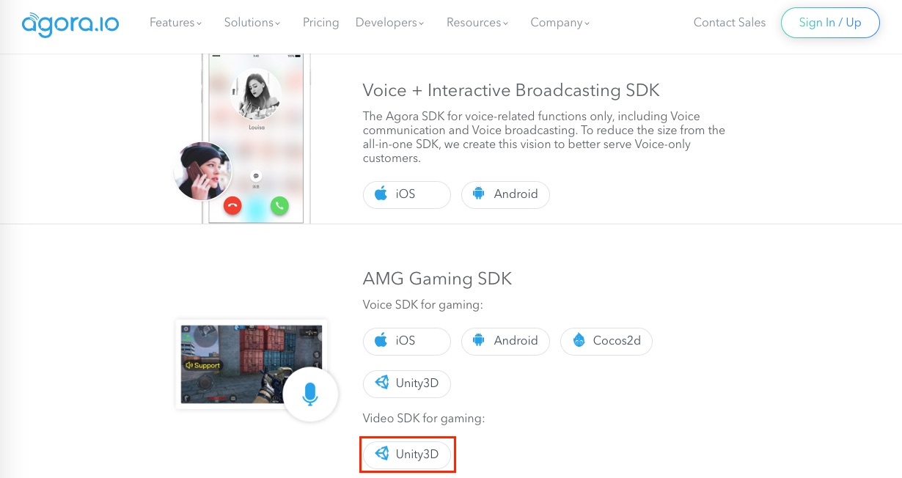

# Spacewar with AMG Voice SDK for Unity

*Read this in other languages: [中文](README.zh.md)*

This tutorial enables you to quickly get started with using a sample app to integrate voice chat into your [Unity 3D](https://unity3d.com) game application using the Agora Gaming SDK.

With this sample app, you can:

- [Join / leave a channel](#add-join-leave-channel-methods)
- [Select voice modes](#add-agora-engine-methods)
- [Mute / unmute audio](#add-button-and-slider-methods)
- [Mix music / play audio effects](#add-background-music-methods)
- [Morphe voice audio](#add-button-and-slider-methods)
- [Set voice and audio effect positions](#add-button-and-slider-methods)
- [Set voice and audio effect volumes](#add-button-and-slider-methods)

## Prerequisites
- Agora.io Developer Account
- Unity 3D 5.5+

## Quick Start
This section shows you how to prepare and build the Agora React Native wrapper for the sample app.

### Create an Account and Obtain an App ID
To build and run the sample application you must obtain an App ID:

1. Create a developer account at [agora.io](https://dashboard.agora.io/signin/). Once you finish the signup process, you will be redirected to the Dashboard.
2. Navigate in the Dashboard tree on the left to **Projects** > **Project List**.
3. Copy the App ID that you obtained from the Dashboard into a text file. You will use this when you launch the app.

### Update and Run the Sample Application

1. Edit the [`ApplicationModel.cs`](Assets/MainScene/Scripts/HelloUnityVideo.cs) file. In the `ApplicationModel` class declaration, update `Your App Id` with your App ID.

	`static public string AppId = "Your App Id";`

2. Download the [Agora Gaming SDK](https://www.agora.io/en/download/) for Unity 3D.

	

3. Unzip the downloaded SDK package and copy the files from the following SDK folders into the associated sample application folders.

SDK Folder|Application Folder
---|---
`libs/Android/`|`Assets/Plugins/Android/`
`libs/iOS/`|`Assets/Plugins/iOS/`
`libs/Scripts/AgoraGamingSDK/`|`Assets/Scripts/AgoraGamingSDK/`

4. Open the project in Unity and run the sample application.

## Resources
- A detailed code walkthrough for this sample is available in [Steps to Create this Sample](./guide.md).
- Complete API documentation is available at the [Document Center](https://docs.agora.io/en/).
- You can file bugs about this sample [here](https://github.com/AgoraIO/Voice-Call-for-Mobile-Gaming/tree/master/Advanced-Voice-Call-for-Gaming/Spacewar-with-AMG-Voice-SDK-Unity/issues).

## Learn More
- A tutorial demo is available [here](https://github.com/AgoraIO/Voice-Call-for-Mobile-Gaming/tree/master/Basic-Voice-Call-for-Gaming/Hello-Unity3D-Agora).
- Spacewar with AMG Voice SDK for [SpriteKit](https://github.com/AgoraIO/Voice-Call-for-Mobile-Gaming/tree/master/Advanced-Voice-Call-for-Gaming/Spacewar-with-AMG-Voice-SDK-SpriteKit)
- Spacewar with AMG Voice SDK for [Cocos2D](https://github.com/AgoraIO/Voice-Call-for-Mobile-Gaming/tree/master/Advanced-Voice-Call-for-Gaming/Spacewar-with-AMG-Voice-SDK-Cocos2d)

## License
This software is under the MIT License (MIT). [View the license](LICENSE.md).