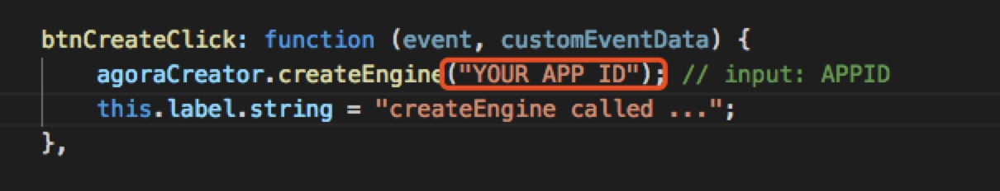
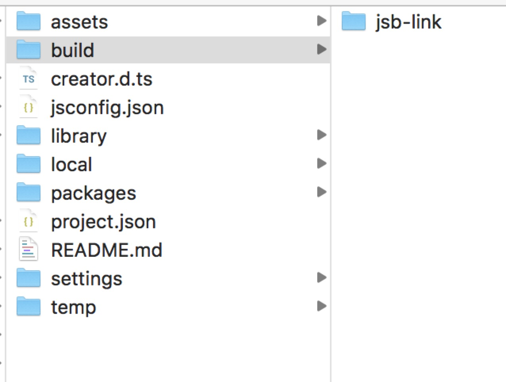
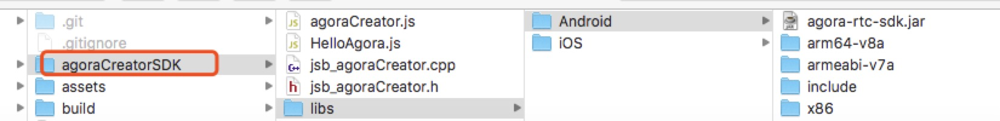

# cocosCreator 集成使用指南


## 1.cocoscreator Demo 编译:
*  创建 Agora 账号并获取 App ID
	1. 进入  ，按照屏幕提示创建一个开发者账号。
	
	2. 登录 Dashboard 页面，点击添加新项目。

	3. 填写项目名， 然后点击提交 。

	4. 在你创建的项目下，查看并获取该项目对应的App ID。
	
* 添加 App ID。

	
	

* 编译配置

	Mac上cocosCreator插件Preference里的Native Develop下配置本地工具路径:

	> NDK root

	> Android SDK Root.

	VPN软件建议关掉，可能会遇到IPC错误。

*  编译

	在运行demo时，选择cocosCreator工具栏的"Project" -> "Build"后，会弹出编译窗口。

	分别"Build" -> “Compile”，Android， iOS平台的demo。
	
	再对agoraCreatorSDK的插件在Android、iOS上进行分别导入、配置，编译。


## 2.开发环境集成

Cocos2d-js开发环境生成的目录结构如下图所示.




agoraCreatorSDK（“libs”文件夹以及JSB封装c++ 文件），这个目录下包含了Android和iOS两个平台所需的所有C++头文件和库文件。


| 文件 |描述 | 
| ------ | ------ | 
| jsb_agoraCreator.cpp |  C++ API JSB 封装 | 
| jsb_agoraCreator.h   |  C++ APIJSB 封装头文件 | 
| iOS 目录   | [互动游戏 SDK:iOS 语音版V2.2](https://docs.agora.io/cn/Agora%20Platform/downloads)，并按照如图放置| 
| Android目录   |[互动游戏 SDK:Android 语音版V2.2](https://docs.agora.io/cn/Agora%20Platform/downloads)，并按照如图放置| 




cocoscreator Demo，构建、编译后，***将agoraCreator目录复制到以下目录***： 

> build/jsb-link/frameworks/runtime-src/
> 
> 或者
> 
> build/jsb-default/frameworks/runtime-src/


注解： runtime-src/ 下会有不同平台的工程。

## 3.Android Studio开发环境配置

打开项目目录里 frameworks/runtime-src/proj.android-studio/下的，Android工程。 

### 修改proj.android-studio/jni/Android.mk

对应位置增加指定内容，分别对Agora实时语音SDK的agoraCreator动态库进行预编译处理、添加头文件路径、链接动态库。


```

LOCAL_PATH := $(call my-dir)

include $(CLEAR_VARS)

#＝＝＝＝＝＝Agora Add 1，start. ＝＝＝＝＝＝＝＝＝#
include $(CLEAR_VARS)
LOCAL_MODULE := agora-rtc
LOCAL_SRC_FILES := ../../../agoraCreatorSDK/libs/Android/$(TARGET_ARCH_ABI)/libagora-rtc-sdk-jni.so
include $(PREBUILT_SHARED_LIBRARY)
#＝＝＝＝＝＝Agora Add 1，end. ＝＝＝＝＝＝＝＝＝#

LOCAL_MODULE := cocos2djs_shared

LOCAL_MODULE_FILENAME := libcocos2djs

ifeq ($(USE_ARM_MODE),1)
LOCAL_ARM_MODE := arm
endif

LOCAL_SRC_FILES := hellojavascript/main.cpp \
				   ../../../Classes/AppDelegate.cpp \
				   ../../../Classes/jsb_module_register.cpp

#＝＝＝＝＝＝Agora Add 2，start. ＝＝＝＝＝＝＝＝＝#
LOCAL_SRC_FILES += $(LOCAL_PATH)/../../../agoraCreatorSDK/jsb_agoraCreator.cpp
#＝＝＝＝＝＝Agora Add 2，end. ＝＝＝＝＝＝＝＝＝#

LOCAL_C_INCLUDES := $(LOCAL_PATH)/../../../Classes

#＝＝＝＝＝＝Agora Add 3，start. ＝＝＝＝＝＝＝＝＝#
LOCAL_C_INCLUDES += $(LOCAL_PATH)/../../../agoraCreatorSDK/libs/Android/include  \
                    $(LOCAL_PATH)/../../../agoraCreatorSDK

#＝＝＝＝＝＝Agora Add 3，end. ＝＝＝＝＝＝＝＝＝#


ifeq ($(USE_ANY_SDK),1)
LOCAL_SRC_FILES += ../../../Classes/anysdk/SDKManager.cpp \
				   ../../../Classes/anysdk/jsb_anysdk_basic_conversions.cpp \
				   ../../../Classes/anysdk/manualanysdkbindings.cpp \
				   ../../../Classes/anysdk/jsb_anysdk_protocols_auto.cpp


LOCAL_C_INCLUDES += $(LOCAL_PATH)/../../../Classes/anysdk

LOCAL_WHOLE_STATIC_LIBRARIES := PluginProtocolStatic
endif


LOCAL_STATIC_LIBRARIES := cocos2dx_static


#＝＝＝＝＝＝Agora Add 4，start. ＝＝＝＝＝＝＝＝＝#
LOCAL_SHARED_LIBRARIES := agora-rtc
#＝＝＝＝＝＝Agora Add 4，end. ＝＝＝＝＝＝＝＝＝#


LOCAL_EXPORT_CFLAGS := -DCOCOS2D_DEBUG=2

include $(BUILD_SHARED_LIBRARY)


$(call import-module, cocos)


```

### 指定需要兼容的架构

修改app/build.graddle, 配置abiFilters.

```
  defaultConfig {
  	applicationId "org.cocos2d.Hello_Agora_CocosCreator"
	minSdkVersion PROP_MIN_SDK_VERSION
	targetSdkVersion PROP_TARGET_SDK_VERSION
	versionCode 1
  	versionName "1.0"

   	// set so supported. Dependent on your requirements.
   	ndk {
   		abiFilters  'armeabi-v7a' //, 'arm64-v8a', 'x86'
   }
 
```

修改proj.android-studio/jni/Application.mk

```
# Uncomment this line to compile to armeabi-v7a, your application will run faster but support less devices
APP_ABI := armeabi-v7a
#APP_ABI := 'armeabi-v7a', 'arm64-v8a', 'x86'

```


### 修改proj.android/AndroidManifest.xml文件

增加

```
<uses-permission android:name="android.permission.WRITE_EXTERNAL_STORAGE" />
<uses-permission android:name="android.permission.RECORD_AUDIO" />
<uses-permission android:name="android.permission.MODIFY_AUDIO_SETTINGS" />
<uses-permission android:name="android.permission.BLUETOOTH" />
```


### app/build.gradle 更新

```

dependencies {
    implementation fileTree(dir: 'libs', include: ['*.jar','*.aar'])
    implementation fileTree(dir: "/Applications/CocosCreator.app/Contents/Resources/cocos2d-x/cocos/platform/android/java/libs", include: ['*.jar'])
    //Agora add,start.
    implementation fileTree(dir: '../../agoraCreatorSDK/libs/Android/', include: ['*.jar'])
    //Agora add,end.
    implementation project(':libcocos2dx')
}

```

### 接口注册

打开Classes/AppDelegate.cpp

* 引入C++接口文件 #include "../agoraCreatorSDK/jsb_agoraCreator.h", 如下： 

```
#endif

#include "../agoraCreatorSDK/jsb_agoraCreator.h"

USING_NS_CC;

AppDelegate::AppDelegate(int width, int height) : Application("Cocos Game", width, height)
{
}

```
* 注册js方法：在AppDelegate::applicationDidFinishLaunching() 中，添加注册函数: 
 	se->addRegisterCallback(register_jsb_agoraCreator);

```
#if (CC_TARGET_PLATFORM == CC_PLATFORM_ANDROID || CC_TARGET_PLATFORM == CC_PLATFORM_IOS) && PACKAGE_ASx
   se->addRegisterCallback(register_all_anysdk_framework);
   se->addRegisterCallback(register_all_anysdk_manual);
#endif
    se->addRegisterCallback(register_jsb_agoraCreator);

    se->start();
```


### AppActivity 加载so

```

public class AppActivity extends Cocos2dxActivity {
    static {
        System.loadLibrary("agora-rtc-sdk-jni");
    }

```

### 运行Android 工程

运行项目目录里 frameworks/runtime-src/proj.android-studio/下的，Android工程。


## 4. iOS集成


#### 导入文件到xcode工程

1.打开到Demo Xcode工程，将AgoraAuidoSDK中的：

>jsb_agoraCreator.h
> 
>jsb_agoraCreator.cpp

拖动到Xcode工程下的'Classses'目录下。


2.将agoraCreatorSDK/libs/iOS下的 AgoraAudioKit.framework，拖动到Xcode里的Frameworks下。


### Agora Framework导入 

Build Settings -> Search Paths -> Framework Search Paths中添加:

> $(SRCROOT)/../agoraCreatorSDK/libs/iOS

建议直接将此ios文件夹拖到xcode需要填入的位置，然后路径会自动生成

添加头文件路径：在Build Settings -> Search Paths -> Header Search Paths中添加: 
> $(SRCROOT)/../agoraCreatorSDK 

建议直接将此agoraCreatorSDK文件夹拖到xcode需要填入的位置，然后路径会自动生成.


### 系统Framework依赖

在Build Phases -> Link Binary With Libraries下添加：

	libresolv.9.tbd
	SystemConfiguration.framework
	CFNetwork.framework
	VideoToolbox.framework
	coreMedia.framework
	CoreTelephony.framework

### 接口注册

打开Classes/AppDelegate.cpp

* 引入C++接口文件 #include "../agoraCreatorSDK/jsb_agoraCreator.h", 如下： 

```
#endif

#include "../agoraCreatorSDK/jsb_agoraCreator.h"

USING_NS_CC;

AppDelegate::AppDelegate(int width, int height) : Application("Cocos Game", width, height)
{
}

```
* 注册js方法：在AppDelegate::applicationDidFinishLaunching() 中，添加注册函数: 
 	se->addRegisterCallback(register_jsb_agoraCreator);

```
#if (CC_TARGET_PLATFORM == CC_PLATFORM_ANDROID || CC_TARGET_PLATFORM == CC_PLATFORM_IOS) && PACKAGE_ASx
   se->addRegisterCallback(register_all_anysdk_framework);
   se->addRegisterCallback(register_all_anysdk_manual);
#endif
    se->addRegisterCallback(register_jsb_agoraCreator);

    se->start();
```


### 添加录音权限


为iOS10以上版本添加录音权限配置 ：首次录音时会向用户申请权限。

打开frameworks/runtime-src/proj.ios_mac/下的ios工程.

选择TARGETS里的info，在Custom iOS Target Properties下新加一个key。选择Privacy-Microphone Usage Description，Value为字符串(授权弹窗出现时提示给用户)。


### 运行iOS工程

直接运行项目目录里，frameworks/runtime-src/proj.ios_mac/下的，ios工程。 


	

	
