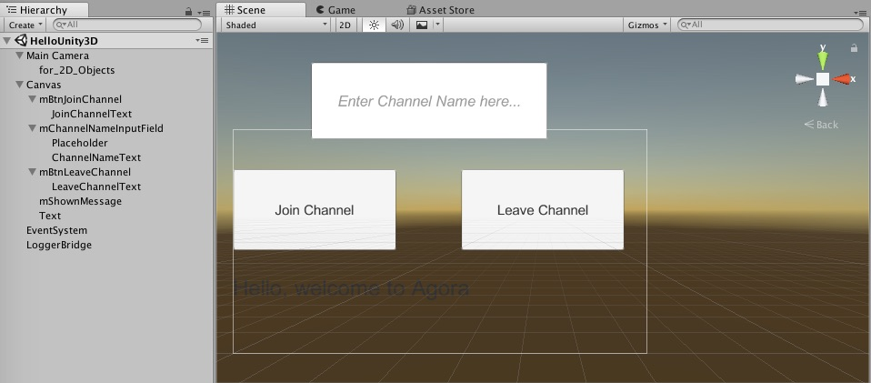

# Hello Unity3D Agora

## Steps to Create the Sample

The sample application is comprised of two main classes, `HelloUnityVideo` and `Home`.

- [Create the Scene](#create-the-scene)
- [Create the HelloUnity3D Class](#create-the-hellounity3d-class)
- [Create the Home Class](#create-the-home-class)

### Create the Scene

The sample application consists of one Unity scene.

When you load `HelloUnity3D` in Unity, you'll see that the stage contains:

UI object|Description
---|---
Text object|Welcome message for the user.
Text input box|Text input box for the user to enter the channel name.
**Join Channel** UI button|Button to join the channel.
**Leave Channel** UI button|Button to leave the channel.

**Note:** You may have to zoom out and adjust the camera view in order to see the leave button in the stage.



**Note:** You may have to zoom out and adjust the camera view in order to see the leave button in the stage.


### Create the HelloUnity3D Class

The `HelloUnity3D` class is a subclass of `MonoBehaviour`. The [`HelloUnity3D.cs`](Assets/HelloUnity3D.cs) file contains the relevant Agora SDK code for the Unity 3D sample application.

```
using System;
using System.Collections;
using System.Collections.Generic;
using UnityEngine;
using UnityEngine.UI;

using agora_gaming_rtc;

public class HelloUnity3D : MonoBehaviour
{
	...
}
```

The remaining code in this section are contained within the `HelloUnity3D` class declaration.

- [Declare Global Variables](#declare-global-variables)
- [Create Initialization Methods](#create-initialization-methods)
- [Join / Leave Channel Methods](#join-leave-channel-methods)

#### Declare Global Variables

The `HelloUnity3D` class has five variables representing the UI objects.

Variable|Description
---|---
`mChannelNameInputField`|Text input field for the channel name.
`mShownMessage`|Welcome message for the user.
`versionText`|Display text for the application version number.
`joinChannel`|**Join Channel** button.
`leaveChannel`|**Leave Channel** button.

``` C++
public InputField mChannelNameInputField;
public Text mShownMessage;
public Text versionText;
public Button joinChannel;
public Button leaveChannel;
```

Declare the `mRtcEngine` variable, which represents the Agora RTC engine for the application and App ID `appId`. The `appId` variable is initialized with the Agora App ID from your Agora Dashboard.

**Note:** `#YOUR APP ID#` must be replaced with a valid Agora App ID.

``` C++
private IRtcEngine mRtcEngine = null;

// PLEASE KEEP THIS App ID IN SAFE PLACE
// Get your own App ID at https://dashboard.agora.io/
// After you entered the App ID, remove ## outside of Your App ID
private string appId = #YOUR APP ID#;
```

#### Create Initialization Methods

- [Create the Awake() Method](#create-the-awake-method)
- [Create the Start() Method](#create-the-start-method)
- [Create the Update() Method](#create-the-update-method)

##### Create the Awake() Method

The `Awake()` method is invoked when the application awakens.

Set video sync count `QualitySettings.vSyncCount` to `0` and the target frame rate `Application.targetFrameRate` to `30`.

``` C++
void Awake ()
{
	QualitySettings.vSyncCount = 0;
	Application.targetFrameRate = 30;
}
```

##### Create the Start() Method

The `Start()` method initializes the application, Agora engine and UI event listeners.

``` C++
// Use this for initialization
void Start ()
{
	...
}
```

- [Add UI Event Listeners and Initialize Agora Engine](#add-ui-event-listeners-and-initialize-agora-engine)
- [Add Channel Join / Leave Event Listeners](#add-channel-join-leave-event-listeners)
- [Add User Event Listeners](#add-user-event-listeners)
- [Add Audio Change Event Listeners](#add-audio-change-event-listeners)
- [Add Warning and Error Event Listeners](#add-warning-and-error-event-listeners)
- [Add the Statistics Event Listener](#add-the-statistic-event-listeners)
- [Add Connection Event Listeners](#add-connection-event-listeners)
- [Configure the Agora RTC Engine](#configure-the-agora-rtc-engine)


###### Add UI Event Listeners and Initialize Agora Engine

Add click event listeners to the `joinChannel` and `leaveChannel` buttons using `onClick.AddListener`.

``` C++
joinChannel.onClick.AddListener (JoinChannel);	
leaveChannel.onClick.AddListener (LeaveChannel);
```

Initialize the Agora RTC engine `mRtcEngine` by passing `appId ` into `IRtcEngine.GetEngine()`.

Update the version display text by retrieving the SDK version using `IRtcEngine.GetSdkVersion()`.

``` C++
mRtcEngine = IRtcEngine.GetEngine (appId);
versionText.GetComponent<Text> ().text ="Version : " + IRtcEngine.GetSdkVersion ();
```

###### Add Channel Join / Leave Event Listeners

The `OnJoinChannelSuccess` event listener for `mRtcEngine` triggers when a user successfully joins a channel.

1. Create a string object `joinSuccessMessage` for the user's `uid`, `channel` name, and SDK `version` using `string.Format ()`.

2. Set a debug log using `Debug.Log ()` and the text for `mShownMessage.GetComponent<Text> ()` with `joinSuccessMessage`.

``` C++
mRtcEngine.OnJoinChannelSuccess += (string channelName, uint uid, int elapsed) => {
	string joinSuccessMessage = string.Format ("joinChannel callback uid: {0}, channel: {1}, version: {2}", uid, channelName, IRtcEngine.GetSdkVersion ());
	Debug.Log (joinSuccessMessage);
	mShownMessage.GetComponent<Text> ().text = (joinSuccessMessage);
};
```

The `OnLeaveChannel` event listener for `mRtcEngine` triggers when a user successfully leaves a channel.

1. Create a string object `leaveChannelMessage` for the session `duration`, `tx` location, `rx` location, `tx` bitrate, and `rx` bitrate using `string.Format ()`.

2. Set a debug log using `Debug.Log ()` and the text for `mShownMessage.GetComponent<Text> ()` with `leaveChannelMessage`.

``` C++
mRtcEngine.OnLeaveChannel += (RtcStats stats) => {
	string leaveChannelMessage = string.Format ("onLeaveChannel callback duration {0}, tx: {1}, rx: {2}, tx kbps: {3}, rx kbps: {4}", stats.duration, stats.txBytes, stats.rxBytes, stats.txKBitRate, stats.rxKBitRate);
	Debug.Log (leaveChannelMessage);
	mShownMessage.GetComponent<Text> ().text = (leaveChannelMessage);
};
```

###### Add User Event Listeners

The `onUserJoined` event listener for `mRtcEngine` triggers when a user joins the channel.

Set a debug log for the user's `uid` and `elapsed` time using `Debug.Log ()`.

``` C++
mRtcEngine.OnUserJoined += (uint uid, int elapsed) => {
	string userJoinedMessage = string.Format ("onUserJoined callback uid {0} {1}", uid, elapsed);
	Debug.Log (userJoinedMessage);
};
```

The `OnUserOffline` event listener for `mRtcEngine` triggers when a user goes offline.

Set a debug log for the user's `uid` and `reason` using `Debug.Log ()`.

``` C++
mRtcEngine.OnUserOffline += (uint uid, USER_OFFLINE_REASON reason) => {
	string userOfflineMessage = string.Format ("onUserOffline callback uid {0} {1}", uid, reason);
	Debug.Log (userOfflineMessage);
};
```

The `OnUserMuted` event listener for `mRtcEngine` triggers when a user mutes their audio.

Set a debug log for the user's `uid` and `muted` status using `Debug.Log ()`.

``` C++
mRtcEngine.OnUserMuted += (uint uid, bool muted) => {
	string userMutedMessage = string.Format ("onUserMuted callback uid {0} {1}", uid, muted);
	Debug.Log (userMutedMessage);
};
```

###### Add Audio Change Event Listeners

The `OnVolumeIndication` event listener for `mRtcEngine` triggers when the audio device indicators change.

If the number of speakers is `0` or invalid, set a debug log for the total volume using `Debug.Log ()`.

Iterate through the speakers and set a debug log for the `speakerNumber`, the speaker's `uid`, and `volume` of the speaker using `Debug.Log ()`.

``` C++
mRtcEngine.OnVolumeIndication += (AudioVolumeInfo[] speakers, int speakerNumber, int totalVolume) => {
	if (speakerNumber == 0 || speakers == null) {
		Debug.Log (string.Format("onVolumeIndication only local {0}", totalVolume));
	}

	for (int idx = 0; idx < speakerNumber; idx++) {
		string volumeIndicationMessage = string.Format ("{0} onVolumeIndication {1} {2}", speakerNumber, 	speakers[idx].uid, speakers[idx].volume);
		Debug.Log (volumeIndicationMessage);
	}
};
```

The `OnAudioRouteChanged` event listener for `mRtcEngine` triggers when the audio route changes.

Set a debug log for the `route` using `Debug.Log ()`.


``` C++
mRtcEngine.OnAudioRouteChanged += (AUDIO_ROUTE route) => {
	string routeMessage = string.Format ("onAudioRouteChanged {0}", route);
	Debug.Log (routeMessage);
};
```

###### Add Warning and Error Event Listeners

The `OnWarning` event listener for `mRtcEngine` triggers when a warning occurs in the Agora RTC engine.

Set a debug log for the `warn` object, warning `msg`, and warning `description` using `Debug.Log ()`.

``` C++
mRtcEngine.OnWarning += (int warn, string msg) => {
	string description = IRtcEngine.GetErrorDescription(warn);
	string warningMessage = string.Format ("onWarning callback {0} {1} {2}", warn, msg, description);
	Debug.Log (warningMessage);
};
```

The `OnError` event listener for `mRtcEngine` triggers when an error occurs in the Agora RTC engine.

Set a debug log for the `error` object, error `msg`, and error `description` using `Debug.Log ()`.

``` C++
mRtcEngine.OnError += (int error, string msg) => {
	string description = IRtcEngine.GetErrorDescription(error);
	string errorMessage = string.Format ("onError callback {0} {1} {2}", error, msg, description);
	Debug.Log (errorMessage);
};
```

###### Add Statistics Event Listeners

The `OnRtcStats` event listener for `mRtcEngine` triggers when the statistics change on the Agora RTC engine.

1. Set a debug log for the following stastics: `duration`,`txBytes`,`rxBytes`,`txKBitRate`,`rxKBitRate`,`txAudioKBitRate`,`rxAudioKBitRate`,`users` using `Debug.Log ()`.

2. Retrieve the length of the mixing file and mixing duration using `mRtcEngine.GetAudioMixingDuration()` and `mRtcEngine.GetAudioMixingCurrentPosition()`.

3. Set a debug log of `lengthOfMixingFile` and `currentTs` using `Debug.Log ()`.

``` C++
mRtcEngine.OnRtcStats += (RtcStats stats) => {
	string rtcStatsMessage = string.Format ("onRtcStats callback duration {0}, tx: {1}, rx: {2}, tx kbps: {3}, rx kbps: {4}, tx(a) kbps: {5}, rx(a) kbps: {6} users {7}",
	stats.duration, stats.txBytes, stats.rxBytes, stats.txKBitRate, stats.rxKBitRate, stats.txAudioKBitRate, stats.rxAudioKBitRate, stats.users);
	Debug.Log (rtcStatsMessage);

	int lengthOfMixingFile = mRtcEngine.GetAudioMixingDuration();
	int currentTs = mRtcEngine.GetAudioMixingCurrentPosition();

	string mixingMessage = string.Format ("Mixing File Meta {0}, {1}", lengthOfMixingFile, currentTs);
	Debug.Log (mixingMessage);
};
```
###### Add Connection Event Listeners

The `OnRequestToken` event listener for `mRtcEngine` triggers when the request token changes.

Set a debug log for the request key message `requestKeyMessage` using `Debug.Log ()`.

``` C++
mRtcEngine.OnRequestToken += () => {
	string requestKeyMessage = string.Format ("OnRequestToken");
	Debug.Log (requestKeyMessage);
};
```

The `OnConnectionInterrupted` event listener for `mRtcEngine` triggers when the connection is interrupted.

Set a debug log for the interruption message `interruptedMessage` using `Debug.Log ()`.

``` C++
mRtcEngine.OnConnectionInterrupted += () => {
	string interruptedMessage = string.Format ("OnConnectionInterrupted");
	Debug.Log (interruptedMessage);
};
```

The `OnConnectionLost` event listener for `mRtcEngine` triggers when the connection is lost.

Set a debug log for the connection lost message `lostMessage` using `Debug.Log ()`.

``` C++
mRtcEngine.OnConnectionLost += () => {
	string lostMessage = string.Format ("OnConnectionLost");
	Debug.Log (lostMessage);
};
```

###### Initialize the Agora RTC Engine

- Set the log filter for the engine using `mRtcEngine.SetLogFilter ()`.
- Set the channel profile to `CHANNEL_PROFILE.GAME_FREE_MODE` using `mRtcEngine.SetChannelProfile ()`.
- Set the client role broadcaster by passing `CLIENT_ROLE.BROADCASTER` into `mRtcEngine.SetClientRole ()`.

``` C++
mRtcEngine.SetLogFilter (LOG_FILTER.INFO);

// mRtcEngine.setLogFile("path_to_file_unity.log");

mRtcEngine.SetChannelProfile (CHANNEL_PROFILE.GAME_FREE_MODE);

// mRtcEngine.SetChannelProfile (CHANNEL_PROFILE.GAME_COMMAND_MODE);
// mRtcEngine.SetClientRole (CLIENT_ROLE.BROADCASTER);
```


##### Create the Update() Method

The `Update()` method is invoked when the application updates.

If `mRtcEngine` is valid, invoke `mRtcEngine.Poll ()`.

``` C++
// Update is called once per frame
void Update ()
{
	if (mRtcEngine != null) {
		mRtcEngine.Poll ();
	}
}
```

#### Join / Leave Channel Methods

The `HelloUnity3D` class has two methods to manage joining and leaving a channel.

##### Create the JoinChannel() Method

The `JoinChannel ()` method joins the user to the channel specified by the text input box `mChannelNameInputField`.

1. Set a debug log for `channelName` using `Debug.Log()`, and ensure `channelName` is not null or empty, before executing the remaining code for the method.

2. Join the channel using `mRtcEngine.JoinChannel ()`.


```
public void JoinChannel ()
{
	string channelName = mChannelNameInputField.text.Trim ();

	Debug.Log (string.Format ("tap joinChannel with channel name {0}", channelName));

	if (string.IsNullOrEmpty (channelName)) {
		return;
	}

	mRtcEngine.JoinChannel (channelName, "extra", 0);
	// mRtcEngine.JoinChannelByKey ("YOUR_CHANNEL_KEY", channelName, "extra", 9527);
}
```

##### Create the LeaveChannel() Method

The `LeaveChannel ()` method exits the user from the current channel.

Leave the channel using `mRtcEngine.LeaveChannel()`.

```
public void LeaveChannel ()
{
	// int duration = mRtcEngine.GetAudioMixingDuration ();
	// int current_duration = mRtcEngine.GetAudioMixingCurrentPosition ();

	// IAudioEffectManager effect = mRtcEngine.GetAudioEffectManager();
	// effect.StopAllEffects ();

	mRtcEngine.LeaveChannel ();
}
```